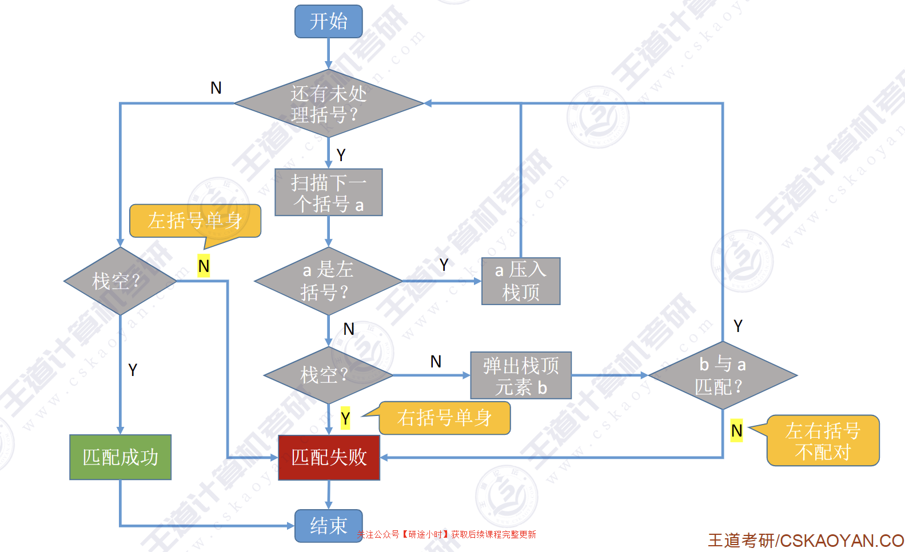

# 栈和队列
## 栈
栈（Stack）是只允许在**一端**进行插入或删除操作的线性表
- 特性:后进先出(LIFO)
### 顺序栈
```c
#define MAXSIZE 10 // 定义栈中元素的最大个数

typedef struct Sequential_stack
{
    int data[MAXSIZE]; // 静态数组字放栈中元素
    int top;           // 栈顶指针
} SqStack;
```
#### 括号匹配

```c
bool BracketCheck(char* str) {
    SqStack S;
    InitStack(&S);
    int i = 0;
    while (str[i] != '\0') {
        if (str[i] == '(' || str[i] == '[' || str[i] == '{') {
            Push(&S, str[i]);
        } else {
            if (EmptyStack(S)) return false;

            char topelem;
            Pop(&S, &topelem);
            if (topelem == '(' && str[i] != ')') return false;
            if (topelem == '[' && str[i] != ']') return false;
            if (topelem == '{' && str[i] != '}') return false;
        }
        i++;
    }
    return EmptyStack(S);
}
```


#### 链栈
```c
typedef struct Linked_stack
{
    int data;
    struct Linked_stack *next;
}*LinkStack;
```
- 头插法建立单链表对应进栈
- 对头结点的“后删操作”对应出栈
- 建议使用不带头结点的方法实现


## 队列
队列（Queue）是只允许在一端进行插入，在另一端删除的线性表
- 队列的特点:先进先出First ln First Out(FIFO)

### 队列顺序存储
```c
#define MAXSIZE 10

typedef struct Sequential_queue
{
    int data[MAXSIZE]; // 用静态数组存放队列元素
    int front, rear;   // 定义队头队尾指针
} SqQueue;

```
队列中元素个数：`(rear+MAXSIZE-front)%MAXSIZE`。这种数据结构会空置一个数组元素。

**使用以下数据结构：**

**方案二：**
```c
#define MAXSIZE 10

typedef struct Sequential_queue
{
    int data[MAXSIZE]; // 用静态数组存放队列元素
    int front, rear;   // 定义队头队尾指针
    int size;          // 当前队列长度
} SqQueue;
```
- 初始化时`rear=front=0;size=0;`；
- 插入成功`size++`，删除成功`size--`；
- 队满条件`size==MAXSIZE`。

**方案三**
```c
#define MAXSIZE 10

typedef struct Sequential_queue
{
    int data[MAXSIZE]; // 用静态数组存放队列元素
    int front, rear;   // 定义队头队尾指针
    int tag;           // 记录最近一次操作是删除还是插入
} SqQueue;
```
- 每次删除操作成功时，都令`tag=0`；每次插入操作成功时,都令`tag=1`；
- 只有删除操作，才可能导致队空；只有插入操作，才可能导致队满；
- 初始化时`rear=fornt=0;flag=0;`
- 队列满的条件为`rear==front&&flag=1;`

### 链队
```c
typedef struct Linked_queue //队结点类型定义
{
    int data;
    struct Linked_queue *next;
}LinkNode;

typedef struct              //链队类型定义  
{
    LinkNode *front ,*rear;
}LinkQueue;

```


在对**没有头结点**的队列进行入队操作时,如果队列为空需要单独处理
```c
void EnQueue(LinkQueue *q,int elem){//不带头结点
    LinkNode* s=(LinkNode*)malloc(sizeof(LinkNode));
    s->data=elem;
    s->next=NULL;
    if(q->front=NULL)
    {
        q->front=s;
        q->rear=s;
    }
    else{
        q->rear->next=s;
    q->rear=s;
    } 
}
```
### [双端队列](./双端队列.mm.md)


