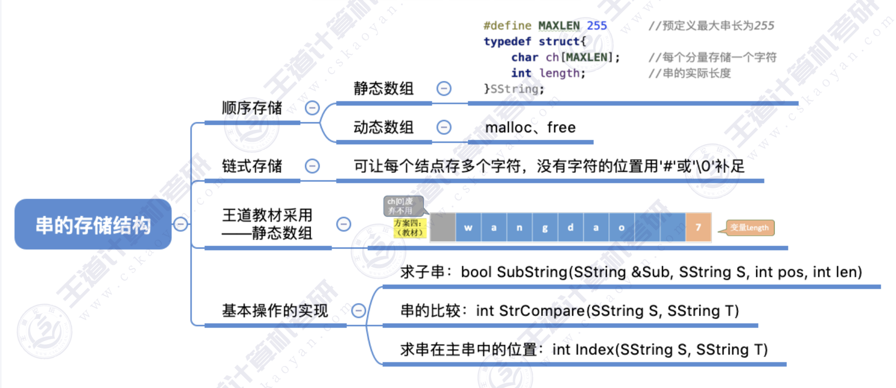

# 串的定义

**串(string)是由零个或多个字符组成的有限序列，又名叫字符串。**
一般记为：$\mathcal{S} = ^\prime$ $a_1$ $a_2$ . . . $a_n^{\prime }$( n> = 0) 。
其中，$\mathcal{S}$是串名，单引号括起来的字符序列是串的值；$\mathfrak{a}_{\mathfrak{n}}$ 可以是字母、数字或其他字符；串中字符的个
数n称为串的长度。

另外还有一些其它概念：

- 空串：n=0时的串称为空串。
- 空格串：是只包含空格的串。注意它与空串的区别，空格串是有内容有长度的，而且可以不止一
个空格。
- 子串与主串：串中任意个数的连续字符组成的子序列称为该串的子串，相应地，包含子串的串称
为主串。
- 子串在主串中的位置就是子串的第一个字符在主串中的序号。

串的逻辑结构和线性表极为相似，区别仅在于串的数据对象限定为字符集。在基本操作上，串和线性表有很大差别。线性表的基本操作主要以单个元素作为操作对象，如查找、插入或删除某个元素等，而串的基本操作通常以子串作为操作对象，如查找，插入或删除一个子串等。

# 串的存储结构

## 1 定长顺序存储表示

类似于线性表的顺序存储结构，用一组地址连续的存储单元存储串值的字符序列。在串的定长顺序存储结构中，为每个串变量分配一个固定长度的存储区，即定长数组。
```c
#define MAXLEN 255	//预定义最大串长为255
typedef struct{
	char ch[MAXLEN];	//每个分量存储一个字符
	int length;	//串的实际长度
}SString;
```

## 2 堆分配存储表示

堆分配存储表示仍然以一组地址连续的存储单元存放串值的字符序列，但它们的存储空间是在程序执
行过程中动态分配得到的。

```c
typedef struct{
	char *ch;	//按串长分配存储区，ch指向串的基地址
	int length;	//串的长度
}HString;
```
在C语言中，存在一一个称之为“堆”的自由存储区，并用malloc()和free()函数来完成动则返回一个指向起始地址的指针，作为串的基地址，这个串由ch指针来指示;若分配失败，则返回NULL。已分配的空间可用free()释放掉。
上述两种存储表示通常为高级程序设计语言所采用。块链存储表示仅做简单介绍。

